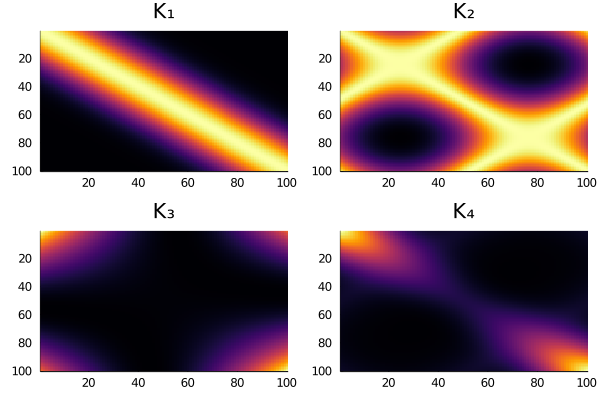

# KernelFunctions.jl

[](https://github.com/JuliaGaussianProcesses/KernelFunctions.jl/actions/workflows/ci.yml?query=branch%3Amaster)
[](https://codecov.io/gh/JuliaGaussianProcesses/KernelFunctions.jl)
[](https://juliagaussianprocesses.github.io/KernelFunctions.jl/stable)
[](https://juliagaussianprocesses.github.io/KernelFunctions.jl/dev)
[](https://github.com/SciML/ColPrac)
[](https://github.com/invenia/BlueStyle)
[](https://zenodo.org/badge/latestdoi/188430419)


## Kernel functions for machine learning

**KernelFunctions.jl** is a general purpose [kernel](https://en.wikipedia.org/wiki/Positive-definite_kernel) package.
It provides a flexible framework for creating kernel functions and manipulating them, and an extensive collection of implementations.
The main goals of this package are:
- **Flexibility**: operations between kernels should be fluid and easy without breaking, with a user-friendly API.
- **Plug-and-play**: being model-agnostic; including the kernels before/after other steps should be straightforward. To interoperate well with generic packages for handling parameters like [ParameterHandling.jl](https://github.com/invenia/ParameterHandling.jl/) and FluxML's [Functors.jl](https://github.com/FluxML/Functors.jl/).
- **Automatic Differentiation compatibility**: all kernel functions which _ought_ to be differentiable using AD packages like [ForwardDiff.jl](https://github.com/JuliaDiff/ForwardDiff.jl) or [Zygote.jl](https://github.com/FluxML/Zygote.jl) _should_ be.

## Examples

```julia
x = range(-3.0, 3.0; length=100)

# A simple standardised squared-exponential / exponentiated-quadratic kernel.
k₁ = SqExponentialKernel()
K₁ = kernelmatrix(k₁, x)

# Set a function transformation on the data
k₂ = Matern32Kernel() ∘ FunctionTransform(sin)
K₂ = kernelmatrix(k₂, x)

# Set a matrix premultiplication on the data
k₃ = PolynomialKernel(; c=2.0, degree=2) ∘ LinearTransform(randn(4, 1))
K₃ = kernelmatrix(k₃, x)

# Add and sum kernels
k₄ = 0.5 * SqExponentialKernel() * LinearKernel(; c=0.5) + 0.4 * k₂
K₄ = kernelmatrix(k₄, x)

plot(
    heatmap.([K₁, K₂, K₃, K₄]; yflip=true, colorbar=false)...;
    layout=(2, 2), title=["K₁" "K₂" "K₃" "K₄"],
)
```
<p align=center>
  
</p>

## Related Work

This package replaces the now-defunct [MLKernels.jl](https://github.com/trthatcher/MLKernels.jl). It incorporates lots of excellent existing work from packages such as [GaussianProcesses.jl](https://github.com/STOR-i/GaussianProcesses.jl), and is used in downstream packages such as [AbstractGPs.jl](https://github.com/JuliaGaussianProcesses/AbstractGPs.jl), [ApproximateGPs.jl](https://github.com/JuliaGaussianProcesses/ApproximateGPs.jl), [Stheno.jl](https://github.com/willtebbutt/Stheno.jl), and [AugmentedGaussianProcesses.jl](https://github.com/theogf/AugmentedGaussianProcesses.jl).

See the JuliaGaussianProcesses [Github organisation](https://github.com/JuliaGaussianProcesses) and [website](https://juliagaussianprocesses.github.io/) for more information.

## Issues/Contributing

If you notice a problem or would like to contribute by adding more kernel functions or features please [submit an issue](https://github.com/JuliaGaussianProcesses/KernelFunctions.jl/issues), or open a PR (please see the [ColPrac](https://github.com/SciML/ColPrac) contribution guidelines).
